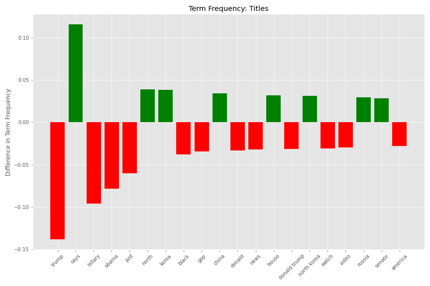
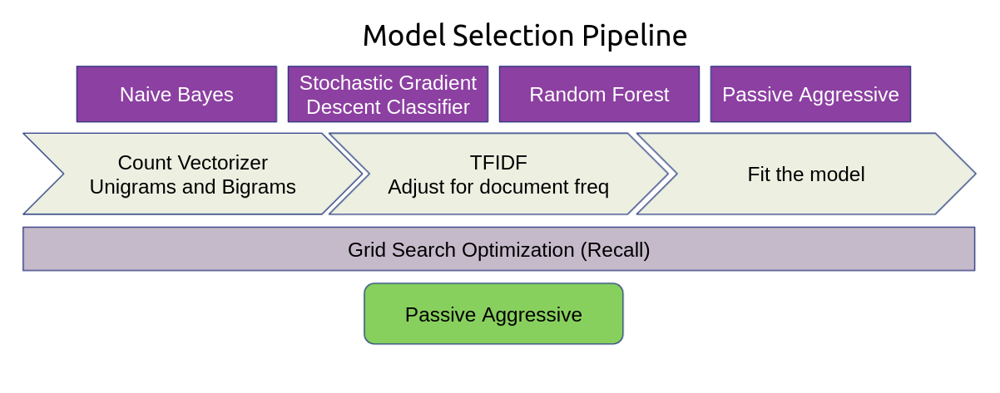
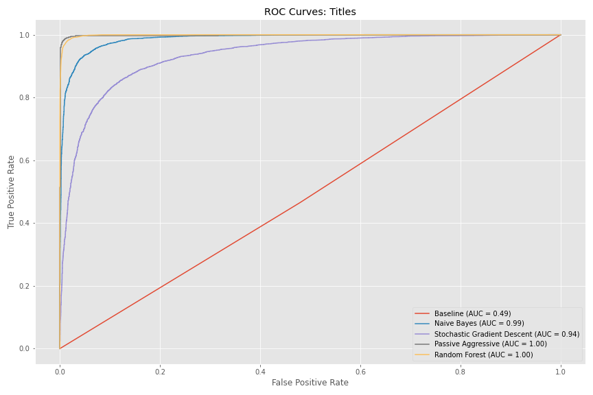
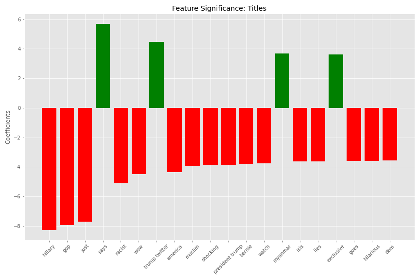

# Fake-News-Identification

## What Even is Fake News?
During the last two U.S. election cycles, the topic of fake news was brought to the forefront of everyone's attention. The term is seemingly self-explanitory, but carries with it some nuance that is worth looking into. Firstly, the narratives expressed in many pieces of fake news are actually based on real events reported by legitimate news outlets, but involve some sort of skew or polarizing lense that classifies it as fake news. For the purpose of this project, fake news is more related to excessive spin on the story, or unfounded reporting.
By classifying news as fake or real, this project aims to flag aricles that we should approach with skepticism as fake, and non-opinion articles from legitimate outlets i.e. Reuters, the New York Times, etc, as real news.

  

## Describing the Data
The data was gathered from an existing [dataset](https://www.uvic.ca/engineering/ece/isot/datasets/fake-news/index.php) curated and labeled by the University of Victoria. The data is also stored in this repository in the data folder as two csv documents representing fake and real news articles from 2017. The data contains 21,417 real news articles and 23,481 fake news articles. The real news was gathered by crawling [Reuters](https://www.reuters.com/) focusing on domesic and world political news. The fake news was gathered by scraping websites marked by politifact, a reputable fact checking agency, and contained mostly political news. For each article in the data, we were given the title, text, full body of text, subject, and date published. Since the subjects did not align between fake and real news, the focus of my classifier was mostly on the text and title features. Each feature required some cleaning to remove artifacts such as the byline and featured image credentials. The goal of cleaning was to make the model judge articles on their content instead of the organization associated with the article or the type of article for that matter.

## Exploring the Data
I began exploring the data by creating a function to generate a word count bar graph for fake news, real news, and finally all news in the dataset. As expected, there was a massive imbalance in word usage for both titles and text, with one word dominating most of the charts. For the sake of clarity, let's just focus on titles for the time being.

  
  

While these graphs highlight a large disparity in word usage, they are also somewhat misleading since there were more fake news articles in the dataset than real news. To account for this, I made another function to graph the difference in term frequency between the two sets of articles. The frequency of terms in fake news was subtracted from that of real news, so positive values appear more frequently in real news than fake news and visa versa.

  

The plot_word_count and plot_word_frequency functions can be imported from the src/models.

## Model Selection

4 models were tested via the above pipeline: Naive Bayes, Suppor Vector Machine(labeled as SGDClassifier in the SKLearn library), Random Forest, and Passive Aggressive. Passive Aggressive is the only online model between the 4 and it surprisingly performed the best, but more on that later. The raw text data was fed into a count vectorizer which removed stopwords and punctuation before tokenizing the terms into unigrams and bigrams. The data was normalized by a TFIDF transformer which helps the model account for different types of term frequency. Finally, the data were fit to each model where hyperparameters, including hyperparameter for the afformentioned vectorizer and transformer, were optimized to maximize recall using gridsearch. This pipeline optimized for recall in order to minimize the type two error of classifying real news as fake. Recall was chosen as the optimization metric under the assumption that these models could be used to filter out fake news, thus minimizing the chace that they would filter out real news by mistake.

**Model Testing**
  
By using the following receiver operator characteristic(ROC) curves generated by each model, we can visually identify the best model for optimizing recall.

  

Although the random forest model offers the highest precision and accuracy among the tested models, the passive aggressive model is the best for optimizing recall. Practically speaking, this optimization choice was made out of fear of offending legitimate journalists by wrongly filtering out content from their organizations. Looking closer at the confusion matrices for our top models, it becomes easier to understand the upsides offered by each.

## Conclusions

Using the Passive Aggressive model from earlier, I was able to extract the most significant features in the model and whether or not the feature indicated that the article was real or fake. Terms with a strong correlation with fake news have a negative coefficient and are displayed below in red. Terms with a positive coefficient indicate a high correlation with real news titles and are shown in green.

  

Below are the top five most fake and most real articles in the dataset.
  

There are a few key observations to make about these 10 article titles. All of the fake articles look like spam titles to the reader, combining hyperbolic language with inconsistant capitalization and crude language. That being said, it is exactly these sorts of articles that tend to go viral, so perhaps there is some use to our classifier. The titles on the right are considerably more "dry" and professional than the fake titles. Before praising the model too much though, it is important to note that there is a clear difference in subject matter between the two classes of articles. The top 5 most real news titles all focused on international news and the top 5 most fake all focused on domestic news. While this is most likely attributed to the distribution of subjects in the data used to train the model, it my also result in the model struggling to classify world news as fake or real. Ultimately, our passive aggressive classification model might be better used to indicate when to exercise skepticism while reading news stories until its abilities as a filter are tested on more current and diverse data.
